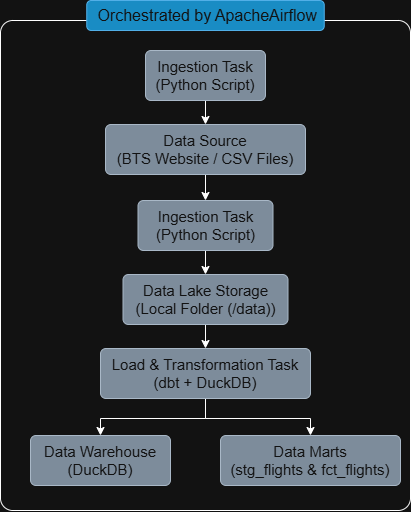

# End-to-End Flight Data Analytics Pipeline

## 1. Objetivo do Projeto

Este projeto demonstra a construção de um pipeline de dados completo e orquestrado, seguindo as melhores práticas de engenharia de dados. O objetivo é ingerir, processar e modelar dados públicos de performance de voos dos EUA para responder a perguntas de negócio, como "Qual a taxa de pontualidade de cada companhia aérea?".

Todo o ambiente é containerizado com Docker, as transformações são gerenciadas pelo dbt e o pipeline é orquestrado pelo Apache Airflow, simulando um ambiente de produção moderno.

## 2. Arquitetura do Pipeline (ELT)

O projeto implementa uma arquitetura **ELT (Extract, Load, Transform)**:





## 3. Tecnologias Utilizadas

* **Containerização:** Docker & Docker Compose
* **Orquestração:** Apache Airflow
* **Linguagem de Programação:** Python
* **Data Warehouse:** DuckDB
* **Ferramenta de Transformação:** dbt (Data Build Tool)
* **Bibliotecas Principais:** Pandas, Requests

## 4. Visão Geral do Pipeline

O pipeline é definido em uma DAG do Airflow (`flight_analytics_pipeline`) e consiste em duas etapas principais:

#### **Etapa 1: `ingest_data` (Extração)**
* Um script Python (`ingest_data.py`) é executado para baixar os dados de performance de voos de um mês específico (ex: Janeiro de 2024) do site do [Bureau of Transportation Statistics](https://www.transtats.bts.gov/OT_Delay/OT_DelayCause1.asp).
* O arquivo `.zip` é descompactado e o `.csv` bruto é salvo em um diretório local (`/data`), que funciona como nosso Data Lake.

#### **Etapa 2: `transform_data` (Carregamento e Transformação)**
* Esta tarefa executa o comando `dbt run`.
* O dbt se conecta ao nosso Data Warehouse (DuckDB) e executa os modelos SQL na ordem correta:
    1.  **`stg_flights` (Staging):** Lê os dados diretamente do arquivo CSV bruto, seleciona as colunas relevantes, renomeia-as para um padrão limpo e converte os tipos de dados.
    2.  **`fct_flights` (Marts):** Agrega os dados limpos da camada de staging para criar uma tabela de fatos com métricas de negócio, como total de voos, voos pontuais, porcentagem de pontualidade e atraso médio por dia e por companhia aérea.

## 5. Estrutura do Projeto


## 6. Como Executar Localmente

**Pré-requisitos:**
* Docker e Docker Compose instalados.

**Passos:**

1.  **Clone o repositório:**
    ```bash
    git clone [https://github.com/seu-usuario/flight_analytics.git](https://github.com/seu-usuario/flight_analytics.git)
    cd flight_analytics
    ```

2.  **Inicialize o banco de dados do Airflow (apenas na primeira vez):**
    ```bash
    docker-compose up airflow-init
    ```

3.  **Inicie todos os serviços:**
    ```bash
    docker-compose up -d
    ```

4.  **Acesse a interface do Airflow:**
    * Abra seu navegador e vá para `http://localhost:8080`.
    * Use as credenciais: `airflow` / `airflow`.

5.  **Execute o pipeline:**
    * Na interface do Airflow, encontre a DAG `flight_analytics_pipeline`.
    * Ative-a clicando no botão de toggle.
    * Para iniciar uma execução manual, clique no botão de "play" (▶️).
